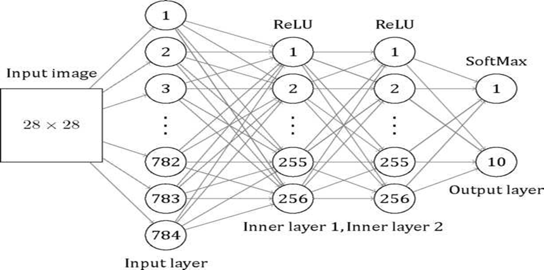
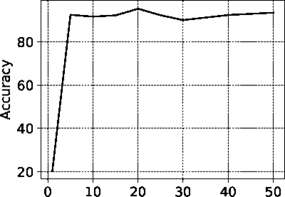
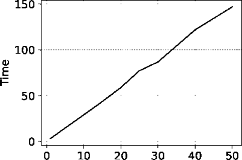
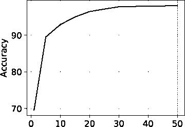
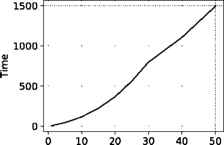
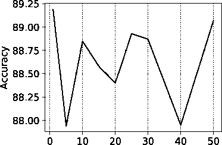
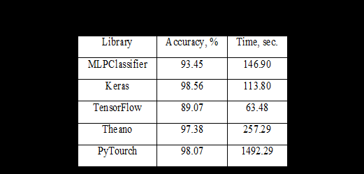
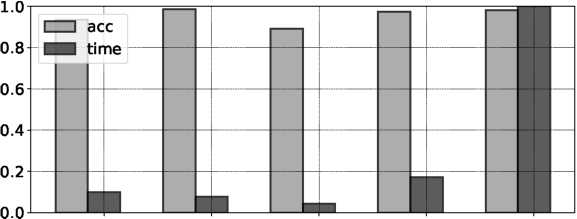
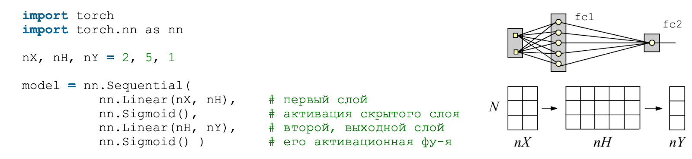

## Сравнение различных библиотек для машинного обучения (scikit-learn, TensorFlow и PyTorch)

## Реализовать задачи классификации и регрессии с использованием scikit-learn, TensorFlow и PyTorch, сравнить их производительность и удобство использования.

**Введение**

**Обзор библиотек машинного обучения (ML)**

  Статья представляет собой обзор. Мы проводим сравнение реальных библиотек машинного обучения, которые можно использовать при разработке нейронных сетей.
В первой части статьи дается краткое описание библиотек TensorFlow, PyTorch, SciKit Learn, Дан обзор области применения этих библиотек и основных технических 
характеристик, таких как производительность, поддерживаемые языки программирования, текущее состояние разработки. Во второй части статьи проводится сравнение трех
библиотек на примере решения задачи распознавания рукописных цифр. Эта проблема хорошо известна и хорошо подходит для
тестирования различных типов нейронных сетей. Время исследования сравнивается в зависимости от количества эпох и точности классификатора. Результаты сравнения
представлены в виде графиков времени обучения и точности в зависимости от количества эпох и в табличной форме.
	В третьей части статьи сравнение удобства работы с библиотеками с точки зрения начинающего программиста нейронных сетей на языке Python.
Сравним наличие в них предопределенных классов и функций для решения типовых, наиболее часто встречающихся задач.

**1. Краткое описание библиотек.**
   
  Из-за огромного развития машинного обучения и науки о данных невозможно рассмотреть разнообразие доступных программных решений. В этом разделе мы рассмотрим только
три популярные библиотеки для разработки нейронных сетей и машинного обучения. Наиболее распространенным языком построения нейронных сетей на данный момент является
язык Python. Существует ряд причин, по которым этот язык занял этот ареал задач.

— Python — простой в изучении язык, активно используемый в сфере школьного и университетского образования. Благодаря этому он завоевал популярность не только в
промышленном программировании, но и среди профессионалов, использующих программирование как инструмент исследования.
— Стандартный интерпретатор cpython упрощает создание привязок для вызовов C-функций, позволяя использовать Python в качестве удобного интерфейса для низкоуровневых
библиотек.
— Сообщество создало широкий спектр инструментов для интерактивного выполнения кода Python и визуализации данных. Особенно это полезно для научных исследований, где 
практически всегда нет оригинального четкого алгоритма решения и необходимо проводить научный поиск. Существенным недостатком Python является его низкая 
производительность, которую можно преодолеть, написав критические части программного обеспечения на компилируемом языке. Многие библиотеки машинного обучения также 
написаны на двух или более языках. Часть программного обеспечения, выполняющая основную часть вычислений, обычно реализуется на C или C++ (ядро или серверная часть).
Pure Python используется для привязок для организации удобного и простого в использовании интерфейса (интерфейсной части или фронтенда). Итак, если библиотека 
реализована на чистом Python, то в большинстве случаев:
— Является дополнением к другой, более низкоуровневой библиотеке и обеспечивает более удобный и простой в освоении интерфейс;
— Он предназначен для образовательных целей или для прототипирования.
Также обратите внимание, что все библиотеки в этом обзоре являются бесплатным программным обеспечением с открытым исходным кодом. Из всех рассмотренных библиотек 
напрямую конкурируют друг с другом только TensorFlow и PyTorch. Остальные библиотеки дополняют функционал друг друга и специализируются в своей области.

**1.1. Что такое scikit-learn и для чего он используется**

  Scikit-learn построен на основе научных вычислительных библиотек NumPy, SciPy и matplotlib.
Введение в scikit-learn. Scikit-learn - это библиотека машинного обучения с открытым исходным кодом для языка программирования Python. Она предоставляет простой и
эффективный инструментарий для решения различных задач, таких как классификация, регрессия, кластеризация, снижение размерности, выбор модели и предобработка данных.
Scikit-learn построен на основе научных вычислительных библиотек NumPy, SciPy и matplotlib. Он предлагает последовательный интерфейс для работы с различными алгоритмами
машинного обучения, что делает его удобным для быстрого прототипирования и экспериментов. Вот несколько примеров использования scikit-learn:

**1.2. TensorFlow**

  Одной из главных альтернатив scikit-learn является TensorFlow. TensorFlow - это мощная библиотека глубокого обучения, разработанная Google. В отличие от scikit-learn, 
которая фокусируется на традиционных алгоритмах машинного обучения, TensorFlow специализируется на построении и обучении нейронных сетей. Он предоставляет гибкие
инструменты для создания сложных архитектур и может использовать GPU для ускорения вычислений. Однако TensorFlow имеет более крутую кривую обучения по сравнению 
со scikit-learn и может быть избыточным для простых задач машинного обучения. TensorFlow упрощает создание моделей машинного обучения, которые могут работать в любой 
среде.
  TensorFlow — это библиотека с открытым исходным кодом, используемая в основном для глубокого машинного обучения. Первоначально она была разработана подразделениями
Google, но в 2015 году она была выпущена как бесплатное программное обеспечение с открытым исходным кодом под лицензией Apache 2.0. Текущая стабильная версия — 2.18.0.
Вычислительное ядро написано на C++ (60% всего кода) с использованием технологии CUDA, что позволяет использовать в вычислениях видеокарты. Интерфейсная часть 
реализована на Python (30% всей кодовой базы). Существуют также неофициальные привязки для других языков, но официально поддерживаются только интерфейсы C++ и Python.
В основе библиотеки лежит принцип потоков данных (dataflow), согласно которому программа организована в виде вычислительных блоков, связанных друг с другом в виде
ориентированного графа, который называется вычислительным графом. Данные обрабатываются путем передачи из одного блока в другой. Такая архитектура приложения позволяет
легко использовать параллельные вычисления как на многоядерных процессорах, так и на распределенных кластерных системах. Кроме того, он хорошо подходит для построения 
нейронных сетей, в которых каждый нейрон представлен независимым компонентом. Помимо вычислительного графа,

TensorFlow — это сквозная платформа для машинного обучения. Он поддерживает следующее:
•	Числовые вычисления на основе многомерных массивов (аналогично NumPy .)
•	GPU и распределенная обработка
•	Автоматическое дифференцирование
•	Построение модели, обучение и экспорт

Тензоры
TensorFlow работает с многомерными массивами или тензорами , представленными в виде объектов tf.Tensor .
TensorFlow реализует стандартные математические операции над тензорами, а также многие операции, специализированные для машинного обучения.
Переменные
Обычные объекты tf.Tensor неизменяемы. Для хранения весов модели (или другого изменяемого состояния) в TensorFlow используйте tf.Variable .
Автоматическое дифференцирование
Градиентный спуск и связанные с ним алгоритмы являются краеугольным камнем современного машинного обучения.
Для этого TensorFlow реализует автоматическое дифференцирование (autodiff), которое использует исчисление для вычисления градиентов. Обычно вы будете использовать 
это для вычисления градиента ошибки или потери модели по отношению к ее весам.
Графики и tf.function
Хотя вы можете использовать TensorFlow в интерактивном режиме, как и любую библиотеку Python, TensorFlow также предоставляет инструменты для:
•	Оптимизация производительности : для ускорения обучения и логического вывода.
•	Экспорт : чтобы вы могли сохранить свою модель, когда она закончит обучение. (трансплатформенность)
Для этого требуется, чтобы вы использовали tf.function , чтобы отделить ваш чистый код TensorFlow от кода Python.
Модули, слои и модели
tf.Module — это класс для управления вашими объектами tf.Variable и объектами tf.function , которые с ними работают. Класс tf.Module необходим для поддержки двух
важных функций:
1.	Вы можете сохранять и восстанавливать значения ваших переменных, используя tf.train.Checkpoint . Это полезно во время обучения, так как позволяет быстро сохранять
и восстанавливать состояние модели.
2.	Вы можете импортировать и экспортировать значения tf.Variable и графики tf.function используя tf.saved_model . Это позволяет запускать вашу модель независимо от
программы Python, которая ее создала.
Тренировочные циклы
Теперь соберите все это вместе, чтобы построить базовую модель и обучить ее с нуля.

**1.3. PyTorch**

   Другой популярной библиотекой является PyTorch, разработанная Facebook. Как и TensorFlow, PyTorch ориентирован на глубокое обучение и предоставляет динамические
вычислительные графы, что делает его удобным для исследований и экспериментов. PyTorch имеет более "питонический" интерфейс по сравнению с TensorFlow и обеспечивает 
большую гибкость в построении моделей. Однако, как и TensorFlow, PyTorch может быть избыточным для традиционных задач машинного обучения, в которых scikit-learn 
преуспевает. Библиотека PyTorch создана на основе Torch. Исходная библиотека Torch была разработана на языке C. С ростом популярности Python в машинном обучении Torch 
был переписан на C++11/CUDA (60% кода) и Python (32% кода). Первоначальная разработка велась в компании Facebook, но в настоящее время PyTorch представляет собой 
библиотеку OpenSource, распространяемую по лицензии типа BSD. Текущая версия — 2.5.1. PyTorch, как и TensorFlow, построен на основе концепции потока данных. Основное
отличие от TensorFlow заключается в том, что в TensorFlow вычислительный граф статический, а в PyTorch граф динамический. Это означает, что граф можно изменять на лету,
добавляя или удаляя узлы по мере необходимости. В TensorFlow весь граф должен быть указан перед запуском модели. Разработчики PyTorch подчеркивают, что Python тесно 
интегрирован с библиотекой (библиотека более питонична). Это упрощает использование, чем с TensorFlow, поскольку пользователю не нужно погружаться в низкоуровневые части,
написанные на С+—Х. Однако стоит отметить, что TensorFlow по популярности превосходит PyTorch, как он появился ранее, и используется во многих образовательных курсах по
машинному обучению.
   Ландшафт ИИ быстро развивается, и модели ИИ развертываются не только на серверах, но и на периферийных устройствах, таких как мобильные телефоны, носимые устройства,
устройства дополненной/виртуальной/смешанной реальности и встроенные устройства. PyTorch Edge расширяет стек исследований и производства PyTorch на эти периферийные
устройства и прокладывает путь для создания инновационных, учитывающих конфиденциальность возможностей с превосходной производительностью, портативностью и
производительностью, оптимизированных для этих разнообразных аппаратных платформЛандшафт ИИ быстро развивается, и модели ИИ развертываются не только на серверах, но и на 
периферийных устройствах, таких как мобильные телефоны, носимые устройства, устройства дополненной/виртуальной/смешанной реальности и встроенные устройства. PyTorch Edge
расширяет стек исследований и производства PyTorch на эти периферийные устройства и прокладывает путь для создания инновационных, учитывающих конфиденциальность
возможностей с превосходной производительностью, портативностью и производительностью, оптимизированных для этих разнообразных аппаратных платформ
   TensorFlow и PyTorch работают совместно с библиотекой Keras. Keras - это высокоуровневый API для глубокого обучения, который может работать поверх TensorFlow. 
Он нацелен на быстрое прототипирование и удобство использования. Keras предоставляет простой интерфейс для построения нейронных сетей и включает множество предварительно
обученных моделей. Однако Keras не так гибок, как низкоуровневые библиотеки, такие как TensorFlow или PyTorch, и может быть ограничен в своих возможностях настройки.

**2     Сравнительный анализ библиотек машинного обучения** [обзорная статья первоисточник](https://repository.rudn.ru/ru/records/article/record/71001/)

**2.1  Описание и архитектура нейронной сети.**

  Для сравнительного анализа библиотек глубокого машинного обучения выберем задачу распознавания рукописных цифр из базы данных 
MNIST и нейронную сеть для ее решения. База данных MNIST содержится в файле CSV, в котором записаны цифры, разделенные запятыми. В файле CSV первое значение — это маркер,
представляющий соответствующую цифру. Следующее значение — это размер цифрового изображения в пикселях, состоящий из 784 значений и имеющий размер квадрата 28x28.
Обучающий файл состоит из 60 тысяч копий, а тестовый файл — из 10 тысяч копий. Для решения задачи мы выбираем архитектуру MLP (многослойный персептрон). Персептрон был 
одной из первых моделей нейронных сетей, которая должна была моделировать нейронные процессы в человеческом сознании. Эта модель была предложена Франком Розенблаттом в 
1957 году и впервые реализована в 1960 году. Многослойный перцептрон по Розенблатту отличается от однослойного тем, что содержит дополнительные скрытые слои.
Нейронная сеть (рис. 1) состоит из входного слоя, двух скрытых слоев и одного выходного слоя. Входной слой содержит 784 нейрона, скрытые слои — 256 нейронов, выходной 
слой — 10 по числу признаков. Функция активации в скрытых слоях — ReLU, которая имеет вид f(x') = max(0,x). В качестве алгоритма оптимизации используется стохастический 
градиентный спуск (SGD).

 

Рис.1 Многослойный персептрон

**2.2 Анализ работы библиотек**	
  Программная реализация нейронной сети с использованием различных библиотек. К сожалению мне не удалось воспроизвести описанные ниже модели и повторить опыты с
ними в полном объеме. По этому пункт второй я полностью процитирую из источника. Далее идет перевод статьи. С помощью каждой библиотеки из обзора выше мы построили
модели перцептрона. Каждая нейронная сеть была обучена, а время обучения и точность измерялись для разного количества периодов обучения. Мы использовали эти измерения
для сравнительного анализа библиотек. Построенные графики описывают зависимость времени и точности обучения от количества эпох (рис. 2-6).

    
  
Epoch
а) Зависимость точности от количества эпох б) зависимость времени от количества эпох

Рис. 2. Результаты работы нейронной сети, построенной с помощью библиотеки SciKit Learn

Первый график показывает зависимость точности от количества эпох. Второй график показывает зависимость времени от количества эпох.
Ниже представлена сводная таблица результатов обучения нейронной сети на 50 эпохах для разных библиотек (см. Таблицу 1).
На диаграмме (рис. 7) показаны значения времени и точности для рассматриваемых библиотек. Все значения нормированы.
 
 
  

Epoch	Epoch
(a) Зависимость точности от количества эпох	              (б) Зависимость времени от количества эпох

Рис. 3. Результаты работы нейросети, построенной с помощью бибилиотеки Py Torch

  

а) Зависимость точности от количества эпох     (б) Зависимость времени от количества эпох

Рис. 4. Результаты работы нейросети, построенной с помощью бибилиотеки TensorFlow 
 
Первый график показывает зависимость времени от количества эпох. Второй график показывает зависимость точности от количества эпох.
Ниже представлена сводная таблица результатов обучения нейронной сети на 50 эпохах для разных библиотек (см. Таблицу 1).
На диаграмме (рис. 7) показаны значения времени и точности для рассматриваемых библиотек. Все значения нормированы.

Table 1
Результат сравнительного анализа библиотек машинного обучения

 
MLPCIassifier Keras Tensorflow Theano PyTourch
Рис. 5. Значения времени и точности

   В библиотеке PyTorch время обучения увеличивается быстрее, чем во всех остальных библиотеках с ростом эпох, время которых примерно одинаково. Время обучения 
библиотек TensorFlow, Scikit-learn и Keras варьируется от 1 до 3 секунд за эпоху. В то время как этот показатель в PyTorch превышает 8 секунд, что в несколько раз
превышает время обучения других библиотек.
Точность библиотеки TensorFlow не превышает 0,9, что является низким показателем по сравнению с другими библиотеками. Scikit-learn также показал результат с низкой 
точностью. Библиотека PyTorch показывает хороший результат по точности только при большом количестве эпох, но с ростом количества эпох время обучения сильно 
увеличивается. Минимальная точность составила 98,07. Библиотеки Keras и Theano являются наиболее точными, их точность поддерживается на уровне 0,98.

**3. Оценка удобства использования.**

**3.1  Установка библиотек.**
  Установку бибилиотек лучше производить с сайтов поддержки библиотек:

  [ https://scikit-learn.org/1.5/install.html ]

  [ https://www.tensorflow.org/install?hl=ru ]

  [ https://pytorch.org/get-started/locally/ ]

  Там все подробно написано и даже команды для разных этапов установки можно скопировать и вставлять в консоль.
  Хотелось бы отдельно сказать о бибилиотеке keras.
  Keras — это API глубокого обучения, написанный на Python и способный работать поверх JAX , TensorFlow или PyTorch .
  Керас — это:
  Просто , но не упрощенно. Keras снижает когнитивную нагрузку разработчика , чтобы вы могли сосредоточиться на тех частях проблемы, которые действительно важны.
  Гибкость — Keras придерживается принципа постепенного раскрытия сложности : простые рабочие процессы должны быть быстрыми и легкими, в то время как произвольно
  сложные рабочие процессы должны быть возможны с помощью четкого пути, который основывается на том, что вы уже изучили.
  Мощный — Keras обеспечивает производительность и масштабируемость, не имеющие аналогов в отрасли: его используют такие организации, как NASA, YouTube и Waymo.
  Именно это написоно на сайте разработчика, от куда его можно установить.

  [ https://keras.io/getting_started/ ]

  Не смотря на то, что после установки у меня в PyCharm он подчеркнут красным и попадает в рязряд ошибок, работу свою выполняет.

**3.2 Наличие встроенных классов и функций для решения типовых задач.**

**3.2.1 Scikit-learn**

  также предоставляет инструменты для предобработки данных, такие как масштабирование признаков, кодирование категориальных переменных и заполнение 
  пропущенных значений. Кроме того, библиотека включает функции для оценки качества моделей, такие как кросс-валидация и метрики производительности.
  Благодаря своей простоте использования, гибкости и широкому набору алгоритмов, scikit-learn стал де-факто стандартной библиотекой для машинного обучения на Python.
  Он используется в различных областях, включая анализ данных, компьютерное зрение, обработку естественного языка и многое другое.

- Классификация: Предсказание категории или класса, к которому принадлежат данные. Например, классификация электронных писем на спам и не спам:

from sklearn.svm import SVC
from sklearn.datasets import load_iris
from sklearn.model_selection import train_test_split

iris = load_iris()
X_train, X_test, y_train, y_test = train_test_split(iris.data, iris.target, test_size=0.2)

clf = SVC()
clf.fit(X_train, y_train)

accuracy = clf.score(X_test, y_test)
print(f"Accuracy: {accuracy:.2f}")

-Регрессия: Предсказание непрерывного значения на основе входных данных. Например, предсказание цен на жилье:

from sklearn.linear_model import LinearRegression
from sklearn.datasets import load_boston
from sklearn.model_selection import train_test_split

boston = load_boston()
X_train, X_test, y_train, y_test = train_test_split(boston.data, boston.target, test_size=0.2)

reg = LinearRegression()
reg.fit(X_train, y_train)

r2_score = reg.score(X_test, y_test)
print(f"R^2 score: {r2_score:.2f}")

-Кластеризация: Группировка похожих объектов в кластеры. Например, сегментация клиентов на основе их поведения:

from sklearn.cluster import KMeans
from sklearn.datasets import make_blobs

X, _ = make_blobs(n_samples=200, centers=3, random_state=42)

kmeans = KMeans(n_clusters=3)
kmeans.fit(X)

labels = kmeans.labels_
print(f"Cluster labels: {labels}")

**3.2.2 Tensor Flow**

-TensorFlow — открытая библиотека для создания и тренировки нейронных сетей. Предоставляет API для облачной, мобильной, десктопной и веб-разработки.
Поначалу создавалась командой Google Brain для внутреннего использования. Имеет интерфейсы для Swift и Javascript. Последняя версия поддерживает высокоуровневый 
API Keras, который написан на Python и работает поверх CNTK, TensorFlow и Theano.
Это одна из самых известных библиотек для нейросетей на Python. Она представляет данные как многомерные массивы, а операции с ними — как графы, которые строятся 
перед запуском программы. В TensorFlow реализовано множество методов для создания, развертывания, обучения и запуска нейросетей и ML-моделей.

Как используется в ML
TensorFlow можно применять в разных направлениях ML, но чаще всего ее используют для построения нейронных сетей и моделей глубокого обучения. Библиотеку применяют 
для классификации изображений, текстов и звуков, а также для NLP — обработки естественного языка. В последние версии TensorFlow по умолчанию включили библиотеку 
Keras, которая позволяет создавать те же модели с меньшим количеством кода.

Кроме того, библиотека TensorFlow адаптирована под разные типы вычислительных платформ, включая мобильные, поэтому ее используют в кросс-платформенной разработке 
ML-решений. Библиотеку часто сравнивают с PyTorch. При этом некоторые специалисты считают, что последняя лучше подходит для решения академических задач,
а TensorFlow — для продакшна. Впрочем, и ту, и другую библиотеку используют в обеих отраслях. Считается, что PyTorch чуть проще в освоении, чем TensorFlow,
но эксперты обычно советуют попробовать обе библиотеки и выбрать ту, которая понравится больше. 

Пример решения задачи по распознаваню текста.

import os
os.environ['TF_CPP_MIN_LOG_LEVEL'] = '2'

import tensorflow as tf
mnist = tf.keras.datasets.mnist

(x_train, y_train),(x_test, y_test) = mnist.load_data()
x_train, x_test = x_train / 255.0, x_test / 255.0

model = tf.keras.models.Sequential([
  tf.keras.layers.Flatten(input_shape=(28, 28)),
  tf.keras.layers.Dense(128, activation='relu'),
  tf.keras.layers.Dropout(0.2),
  tf.keras.layers.Dense(10, activation='softmax')
])

model.compile(optimizer='adam',
  loss='sparse_categorical_crossentropy',
  metrics=['accuracy'])

model.fit(x_train, y_train, epochs=5)
model.evaluate(x_test, y_test)

**3.2.3 Torch**

-Пакет torch содержит структуры данных для многомерных тензоров и определяет математические операции над этими тензорами. Кроме того, он предоставляет 
 множество утилит для эффективной сериализации тензоров и произвольных типов, а также другие полезные утилиты. У него есть аналог CUDA, который позволяет
 запускать тензорные вычисления на графическом процессоре NVIDIA с вычислительной мощностью >= 3.0. Очень популярная библиотека среди фанатов Machine Learning.
 Создана на базе Torch, развивается в стенах Facebook. По сути, это пакет Python, поддерживающий тензорные вычисления с GPU-ускорением и работу с нейросетями
 через систему autograd.
-Как используется в ML
 Эта библиотека считается основой для решения целой экосистемы задач: компьютерного зрения, обработки естественного языка, обучения роботов и агентов в виртуальной
 и реальной средах. 

Пример решения задачи.
С помощью PyTorch можно легко создавать простые модели нейронных сетей. Например, код ниже описывает нейросеть из двух линейных слоев с функцией активации для 
каждого слоя. Эта сеть классифицирует входные данные — относит или к одной, или к другой категории.

Более сложные сети моделируются с помощью классов. Внутри класса можно описать основные структурные части нейросети, а затем создать модель — объект этого класса.

**4. Заключение**
На основе сравнения разных библиотек можно сделать ряд выводов. Почти все библиотеки, кроме PyTorch, показывают примерно одинаковое время обучения. В случае с PyTorch 
более длительное время обучения можно объяснить поддержкой динамического вычислительного графа, что, по-видимому, влечет за собой дополнительные вычислительные 
затраты. В свою очередь библиотека TensorFlow показала средний результат по точности, уступив PyTorch.

References
[ https://repository.rudn.ru/ru/records/article/record/71001/ ]
[1]	G. Van Rossum and F. L. Drake Jr, Python tutorial. Centrum voor Wiskunde en Informatica Amsterdam, The Netherlands, 1995.
[2]	T. Kluyver et al., “Jupyter Notebooks — a publishing format for repro¬ducible computational workflows,” in Positioning and Power in Academic Publishing: Players, 
Agents and Agendas, F. Loizides and B. Schmidt, Eds., IOS Press, 2016, pp. 87-90. doi: 10.3233/978-1-61499-649-1¬87.
[3]	J. D. Hunter, “Matplotlib: A 2D graphics environment,” Computing in Science & Engineering, vol. 9, no. 3, pp. 90-95, 2007. doi: 10.1109/ MCSE.2007.55.
[4]	F. Perez and B. E. Granger, “IPython: a system for interactive scientific computing,” Computing in Science and Engineering, vol. 9, no. 3, pp. 21¬29, May 2007.
doi: 10.1109/MCSE.2007.53.
[5]	S. Behnel, R. Bradshaw, C. Citro, L. Dalcin, D. S. Seljebotn, and K. Smith, “Cython: the best of both worlds,” Computing in Science & Engineering, vol. 13, no.
2, pp. 31-39, Mar. 2011. doi: 10.1109/MCSE. 2010.118.
[6]	S. van der Walt, S. C. Colbert, and G. Varoquaux, “The NumPy array: a structure for efficient numerical computation,” Computing in Science Engineering, vol. 13, 
no. 2, pp. 22-30, Mar. 2011. doi: 10.1109/MCSE. 2011.37.
[7]	E. Jones, T. Oliphant, P. Peterson, et al. (2001-). SciPy: open source scientific tools for Python, [Online]. Available: [ http://www.scipy.org/. ]
[8]	W. McKinney, “Data structures for statistical computing in Python,” in Proceedings of the 9th Python in Science Conference, S. van der Walt and J. Millman, Eds., 
2010, pp. 51-56.
[9]	Martin Abadi et al. (2015). TensorFlow: large-scale machine learning on heterogeneous systems. Software available from tensorflow.org, [Online].
Available:] http://tensorflow.org/. ]
[10]	(2019). TensorFlow official repository, [Online]. Available: https:// github.com/tensorflow/tensorflow.
[11]	A. Paszke, S. Gross, S. Chintala, G. Chanan, E. Yang, Z. DeVito, Z. Lin, A. Desmaison, L. Antiga, and A. Lerer, 
“Automatic differentiation in PyTorch,” in 31st Conference on Neural Information Processing Systems (NIPS 2017), Long Beach, CA, USA, 2017.
[12]	(2019). Torch official repository, [Online]. Available:] https://github.com/torch/torch7. ]
[13]	Theano Development Team, “Theano: a Python framework for fast computation of mathematical expressions,” May 2016. eprint: arXiv: abs/1605.02688.
[14]	F. Chollet. (2019). Keras, [Online]. Available: https://keras.io/.
[15]	(2019). CNTC official repository, [Online]. Available: https://github. com/Microsoft/cntk.
[16]	F. Pedregosa et al., “Scikit-learn: machine learning in Python,” Journal of Machine Learning Research, vol. 12, pp. 2825-2830, 2011.
[17]	(2019). MNIST handwritten digit database, Yann LeCun, Corinna Cortes and Chris Burges, [Online]. Available: [ http://yann.lecun.com/exdb/mnist/. ]
[18]	F. Rosenblatt, “The perceptron: a probabilistic model for information storage and organization in the brain,” Psychological review, vol. 65, no. 6, 1958.
DOI: 10.1037/h0042519.
[19]	X. Glorot, A. Bordes, and Y. Bengio, “Deep Sparse Rectifier Neural Networks,” in Proceedings of the Fourteenth International Conference on Artificial 
Intelligence a,nd Statistics, G. Gordon, D. Dunson, and M. Dudlk, Eds., ser. Proceedings of Machine Learning Research, vol. 15, Fort Lauderdale, FL, USA: PMLR, Nov. 
2011, pp. 315-323.
[20]	T. Zhang, “Solving large scale linear prediction problems using sto¬chastic gradient descent algorithms,” in Proceedings of the Twenty-first International
Conference on Machine Learning, ser. ICML ’04, Banff, Alberta, Canada: ACM, 2004. DOI: 10.1145/1015330.1015332.
For citation:
M. N. Gevorkyan, A. V. Demidova, T. S. Demidova, A. A. Sobolev, Review and comparative analysis of machine learning libraries for machine learn¬ing, Discrete and 
Continuous Models and Applied Computational Science 27 (4) (2019) 305-315. DOI: 10.22363/2658-4670-2019-27-4-305-315.
Information about the authors:
Migran N. Gevorkyan — Candidate of Physical and Mathe¬matical Sciences, assistant professor of Department of Applied Probability and Informatics of Peoples’ 
Friendship University of Russia (RUDN University) (e-mail: gevorkyan-mn@rudn.ru, phone: +7(495)9520250, ORCID: [ https://orcid.org/0000-0002-4834-4895, ResearcherID:
E-9214-2016, Scopus Author ID: 57190004380) ]
Anastasia V. Demidova — Candidate of Physical and Math¬ematical Sciences, assistant professor of Department of Applied Probability and Informatics of Peoples’
Friendship University of Russia (RUDN University) (e-mail: demidova-av@rudn.ru, phone: +7(495)9520250, ORCID: [] https://orcid.org/0000-0003-1000-9650, ResearcherID:
AAD-2214-2019, Scopus Author ID: 57191952809) ]
Tatiana S. Demidova — student of Department of Applied Probability and Informatics of Peoples’ Friendship University of Russia (RUDN University) (e-mail: 
1032152607@pfur.ru, phone: +7(495)9520250, ORCID: [ https://orcid.org/0000-0001-6076-1619, Scopus Author ID: 57210151914) ]
Anton A. Sobolev — student of Department of Applied Probability and Informatics of Peoples’ Friendship University of Russia (RUDN University) (e-mail: 
1032152618@pfur.ru, phone: +7(495)9520250, ORCID: [ https://orcid.org/0000-0003-1629-1378, Scopus Author ID: 57206139419) ]
УДК 519.21;51-76
DOI: 10.22363/2658-4670-2019-27-4-305-315

